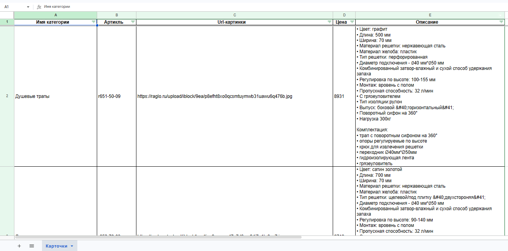

# Raglo Parser

Парсер интернет-магазина raglo.ru для сбора товаров из 8 категорий с пагинацией. Данные выгружаются в форматированный Excel-файл.

## Возможности

- Парсинг товаров из 8 категорий (душевые трапы, дозаторы, смесители, полотенцесушители и др.)
- Пагинация (автоматический переход по страницам внутри категории)
- Параллельная загрузка страниц товаров (до 20 потоков)
- Повторные попытки при ошибках сети (retry с задержкой)
- Обработка ошибок (если один товар не спарсился — остальные продолжают работу)
- Выгрузка в Excel с форматированием:
  - заголовки
  - границы
  - автофильтр
  - закрепление шапки

## Как запустить

1 вариант

1. Установите .NET SDK.
2. Клонируйте репозиторий.
3. Откройте решение в Visual Studio или Rider.
4. Запустите проект RagloParser.
5. После завершения работы откроется файл `Card.xlsx` в папке с программой.

2 вариант

1. Скачайте готовый файл с этого репозитория в формате .zip, который содержит в себе все библиотеки
2. Распакуйте архив
3. После завершения работы откроется файл `Card.xlsx` в папке с программой.

## Пример результата

