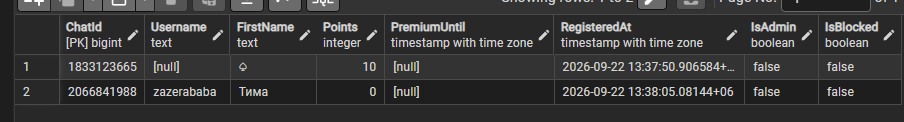
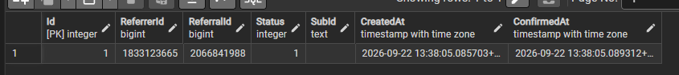
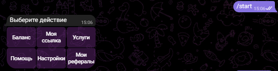

# ReferralBot

В этом репозитории находится бот с реферальной системой и записью рефералов и транзакций в базу данных


## Стек технологий

- C# / .NET (net10.0)
- EF Core
- PostgreSQL
- Telegram.Bot
- ASP.NET Core (Minimal API)


## Архитектура

- BotStart - запуск бота и его бекенд
- ConfigurationLibrary - библиотека конфигураций (AppDbContext, Interfaces)
- DataLibrary - модели данных, enum
- DTOLibrary - модели DTO


## Функционал

- Добавление пользователей в базу данных
- Добавление связи приглашающего и приглашенного в базу данных
- Начисление валюты приглашающему
- История начислений в базе данных
- Inline-меню с 6 кнопками
- Баланс / ссылка / рефералы
- Проверка на приглашение себя
- Можно заблокировать пользователя (IsBlocked)


## Как запустить и протестировать

1. Установите .NET SDK.
2. Клонируйте репозиторий.
3. Откройте решение в Visual Studio или Rider.
4. Создайте бота в Telegram через @BotFather, скопируйте API токен и вставьте в appsettings.json в строчку Token:
5. Установите PostgreSQL. Обычно есть пользователь postgres. Создайте базу данных (например, referral_bot_db)
6. Вставьте строчку типа "Host=localhost;Port=????;Username=postgres;Password=????;Database=????" в appsettings.json в строчку Postgres:
7. Примените миграции к базе данных:
   ```bash
   dotnet ef database update --project ConfigurationLibrary --startup-project BotStart
   ```
8. Запустите проект ReferralBot.


## Пример результата

Пример того, как бот записывает данные в бд (для тестов будут нужны несколько аккаунтов/человек)
 

